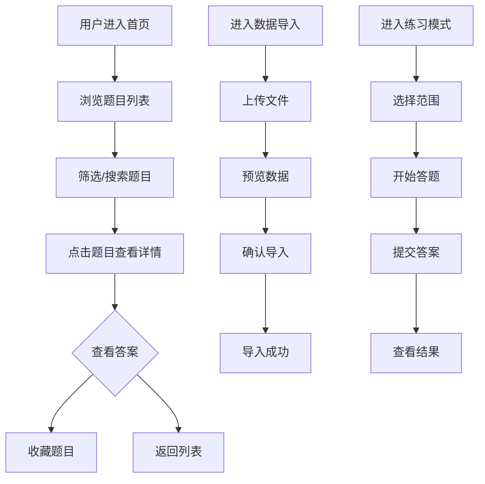

## 1. Product Overview

AI Agent面试题库是一个面向开发者和求职者的在线学习平台，专注于AI Agent领域的面试题训练。用户可以浏览、练习题目，还能上传自己的私有题库数据，打造个性化学习体验。

## 2. Core Features

### 2.1 User Roles
| Role | Registration Method | Core Permissions |
|------|---------------------|------------------|
| Normal User | Email registration | Browse questions, practice, upload private data |
| Admin | Invitation only | Manage public questions, moderate content |

### 2.2 Feature Module
1. **首页**: 题目列表、分类筛选、搜索功能、快速练习入口
2. **题目详情页**: 题目内容、选项、答案解析、收藏功能、相关题目推荐
3. **数据导入页**: 支持Excel/CSV文件上传、数据预览、批量导入私有题库
4. **练习模式**: 随机抽取题目、计时答题、正确率统计
5. **我的题库**: 管理私有数据、分类管理、编辑删除题目

### 2.3 Page Details
| Page Name | Module Name | Feature description |
|-----------|-------------|---------------------|
| 首页 | Hero区域 | 平台介绍、核心统计数据展示 |
| 首页 | 题目列表 | 分页展示题目，支持按分类、难度筛选 |
| 首页 | 搜索框 | 支持关键词搜索题目内容 |
| 题目详情页 | 题目展示 | 完整题目描述、选项、代码块支持 |
| 题目详情页 | 答案解析 | 展开/收起式答案和详细解析 |
| 题目详情页 | 收藏功能 | 一键收藏到个人题库 |
| 数据导入页 | 文件上传 | 支持拖拽上传Excel/CSV文件 |
| 数据导入页 | 数据预览 | 导入前预览数据格式和内容 |
| 数据导入页 | 批量导入 | 确认后批量导入私有题库 |
| 练习模式 | 答题界面 | 单题展示、计时功能、答案选择 |
| 练习模式 | 结果统计 | 答题正确率、用时统计、错题回顾 |
| 我的题库 | 私有数据管理 | 查看、编辑、删除私有题目 |
| 我的题库 | 分类管理 | 创建、编辑、删除题目分类 |

## 3. Core Process

### 用户浏览题目流程
用户进入首页 → 选择分类/难度筛选 → 浏览题目列表 → 点击题目查看详情 → 查看答案解析 → 收藏题目

### 数据导入流程
用户进入数据导入页 → 上传Excel/CSV文件 → 预览数据 → 确认导入 → 导入成功提示

### 练习模式流程
用户进入练习模式 → 选择题目范围 → 开始答题 → 选择答案 → 查看结果 → 统计分析

## 4. User Interface Design

### 4.1 Design Style
- **主色调**: 科技蓝 (#1E40AF) + 活力橙 (#F97316)
- **辅助色**: 深蓝背景 (#0F172A)、卡片灰 (#1E293B)
- **按钮风格**: 圆角矩形、渐变效果、hover动效
- **字体**: 标题用 Inter Bold，正文用 Inter Regular
- **布局风格**: 卡片式布局、深色主题、现代感设计
- **图标**: Lucide React 图标库

### 4.2 Page Design Overview
| Page Name | Module Name | UI Elements |
|-----------|-------------|-------------|
| 首页 | Hero区域 | 渐变背景、统计卡片、快速入口按钮 |
| 首页 | 题目列表 | 卡片网格布局、分类标签、难度标识 |
| 题目详情页 | 题目展示 | 代码高亮、选项卡片、展开式答案 |
| 数据导入页 | 文件上传 | 拖拽区域、文件预览表格 |
| 练习模式 | 答题界面 | 倒计时、进度条、选项按钮 |

### 4.3 Responsiveness
- **桌面端**: 多列卡片布局、侧边栏导航
- **平板端**: 双列布局、简化导航
- **移动端**: 单列布局、底部导航栏

### 4.4 3D Scene Guidance
- 暂不涉及3D场景
