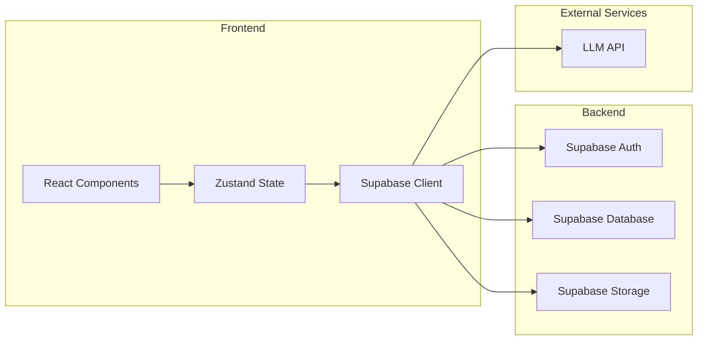
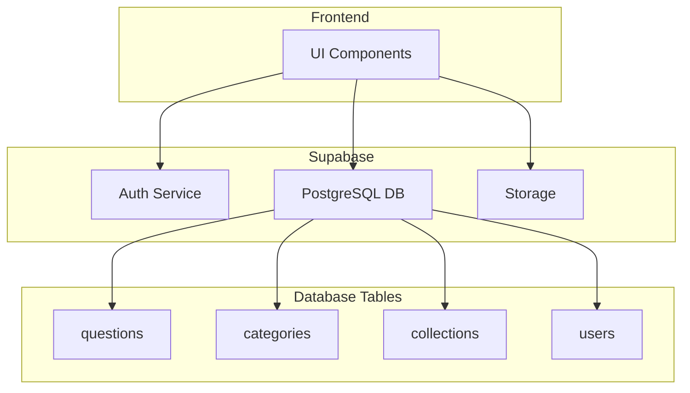
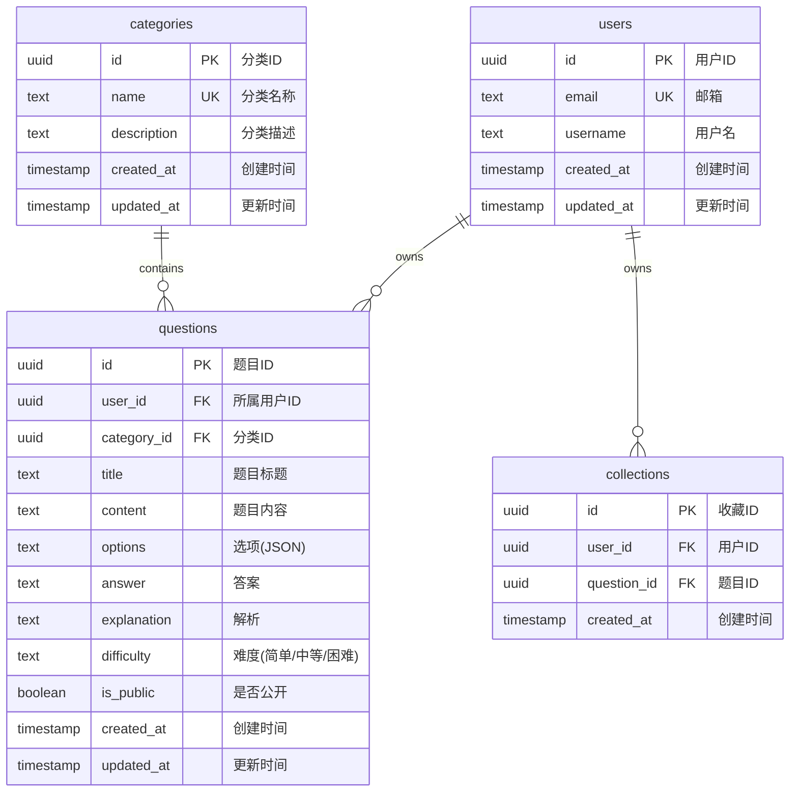

## 1. Architecture Design



## 2. Technology Description
- **Frontend**: React@18 + TypeScript + TailwindCSS@3 + Vite
- **State Management**: Zustand
- **Routing**: React Router DOM
- **Backend**: Supabase (Auth, Database, Storage)
- **Initialization Tool**: vite-init
- **Database**: Supabase PostgreSQL

## 3. Route Definitions
| Route | Purpose |
|-------|---------|
| / | 首页 - 题目列表和搜索 |
| /question/:id | 题目详情页 |
| /import | 数据导入页 |
| /practice | 练习模式页 |
| /my-questions | 我的题库页 |
| /categories | 分类管理页 |
| /login | 登录页 |
| /register | 注册页 |

## 4. API Definitions

### 4.1 Auth API
| Endpoint | Method | Description |
|----------|--------|-------------|
| /api/auth/signup | POST | 用户注册 |
| /api/auth/signin | POST | 用户登录 |
| /api/auth/signout | POST | 用户登出 |
| /api/auth/user | GET | 获取当前用户 |

### 4.2 Questions API
| Endpoint | Method | Description |
|----------|--------|-------------|
| /api/questions | GET | 获取题目列表 |
| /api/questions/:id | GET | 获取单个题目 |
| /api/questions | POST | 创建题目 |
| /api/questions/:id | PUT | 更新题目 |
| /api/questions/:id | DELETE | 删除题目 |

### 4.3 Categories API
| Endpoint | Method | Description |
|----------|--------|-------------|
| /api/categories | GET | 获取分类列表 |
| /api/categories | POST | 创建分类 |
| /api/categories/:id | PUT | 更新分类 |
| /api/categories/:id | DELETE | 删除分类 |

### 4.4 Collections API
| Endpoint | Method | Description |
|----------|--------|-------------|
| /api/collections | GET | 获取收藏列表 |
| /api/collections | POST | 收藏题目 |
| /api/collections/:id | DELETE | 取消收藏 |

## 5. Server Architecture Diagram



## 6. Data Model

### 6.1 Data Model Definition



### 6.2 Data Definition Language

```sql
CREATE TABLE users (
    id UUID PRIMARY KEY DEFAULT uuid_generate_v4(),
    email TEXT UNIQUE NOT NULL,
    username TEXT,
    created_at TIMESTAMP WITH TIME ZONE DEFAULT NOW(),
    updated_at TIMESTAMP WITH TIME ZONE DEFAULT NOW()
);

CREATE TABLE categories (
    id UUID PRIMARY KEY DEFAULT uuid_generate_v4(),
    name TEXT UNIQUE NOT NULL,
    description TEXT,
    created_at TIMESTAMP WITH TIME ZONE DEFAULT NOW(),
    updated_at TIMESTAMP WITH TIME ZONE DEFAULT NOW()
);

CREATE TABLE questions (
    id UUID PRIMARY KEY DEFAULT uuid_generate_v4(),
    user_id UUID REFERENCES users(id),
    category_id UUID REFERENCES categories(id),
    title TEXT NOT NULL,
    content TEXT NOT NULL,
    options JSONB NOT NULL,
    answer TEXT NOT NULL,
    explanation TEXT,
    difficulty TEXT DEFAULT 'medium',
    is_public BOOLEAN DEFAULT FALSE,
    created_at TIMESTAMP WITH TIME ZONE DEFAULT NOW(),
    updated_at TIMESTAMP WITH TIME ZONE DEFAULT NOW()
);

CREATE TABLE collections (
    id UUID PRIMARY KEY DEFAULT uuid_generate_v4(),
    user_id UUID REFERENCES users(id),
    question_id UUID REFERENCES questions(id),
    created_at TIMESTAMP WITH TIME ZONE DEFAULT NOW(),
    UNIQUE(user_id, question_id)
);

CREATE INDEX idx_questions_user_id ON questions(user_id);
CREATE INDEX idx_questions_category_id ON questions(category_id);
CREATE INDEX idx_collections_user_id ON collections(user_id);
CREATE INDEX idx_collections_question_id ON collections(question_id);
```

### 6.3 RLS Policies

```sql
ALTER TABLE users ENABLE ROW LEVEL SECURITY;
ALTER TABLE categories ENABLE ROW LEVEL SECURITY;
ALTER TABLE questions ENABLE ROW LEVEL SECURITY;
ALTER TABLE collections ENABLE ROW LEVEL SECURITY;

CREATE POLICY "Users can view their own profile" ON users
    FOR SELECT USING (auth.uid() = id);

CREATE POLICY "Users can update their own profile" ON users
    FOR UPDATE USING (auth.uid() = id);

CREATE POLICY "Public categories are visible to all" ON categories
    FOR SELECT USING (true);

CREATE POLICY "Authenticated users can create categories" ON categories
    FOR INSERT WITH CHECK (auth.uid() IS NOT NULL);

CREATE POLICY "Users can view public questions" ON questions
    FOR SELECT USING (is_public = true OR auth.uid() = user_id);

CREATE POLICY "Users can view their own questions" ON questions
    FOR SELECT USING (auth.uid() = user_id);

CREATE POLICY "Users can create questions" ON questions
    FOR INSERT WITH CHECK (auth.uid() = user_id);

CREATE POLICY "Users can update their own questions" ON questions
    FOR UPDATE USING (auth.uid() = user_id);

CREATE POLICY "Users can delete their own questions" ON questions
    FOR DELETE USING (auth.uid() = user_id);

CREATE POLICY "Users can view their own collections" ON collections
    FOR SELECT USING (auth.uid() = user_id);

CREATE POLICY "Users can create collections" ON collections
    FOR INSERT WITH CHECK (auth.uid() = user_id);

CREATE POLICY "Users can delete their own collections" ON collections
    FOR DELETE USING (auth.uid() = user_id);
```

### 6.4 Initial Data

```sql
INSERT INTO categories (name, description) VALUES
('Prompt Engineering', '提示词工程相关题目'),
('Agent Architecture', 'Agent架构设计题目'),
('RAG', '检索增强生成相关题目'),
('LLM Integration', '大语言模型集成题目'),
('Multi-Agent Systems', '多Agent系统题目'),
('Evaluation', '评估与测试题目');

INSERT INTO questions (user_id, category_id, title, content, options, answer, explanation, difficulty, is_public) VALUES
(
    'demo-user-id',
    (SELECT id FROM categories WHERE name = 'Prompt Engineering'),
    '什么是零样本学习？',
    '请解释什么是零样本学习（Zero-shot Learning），并举例说明其在AI Agent中的应用场景。',
    '[
        "A. 模型从未见过的任务也能完成",
        "B. 只使用零个样本进行训练",
        "C. 模型输出为零",
        "D. 无监督学习的一种"
    ]',
    'A',
    '零样本学习是指模型在从未见过某个任务或类别的样本情况下，仍然能够完成该任务。在AI Agent中，这意味着Agent可以处理训练数据中不存在的任务类型，通过理解自然语言指令来执行新任务。',
    'easy',
    true
);
```
